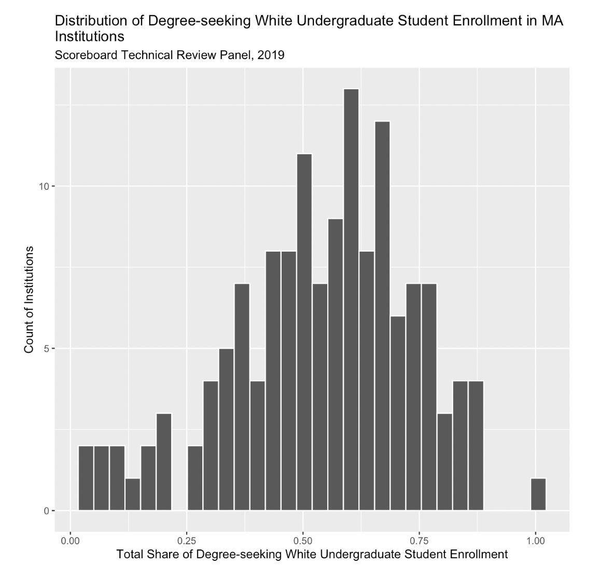
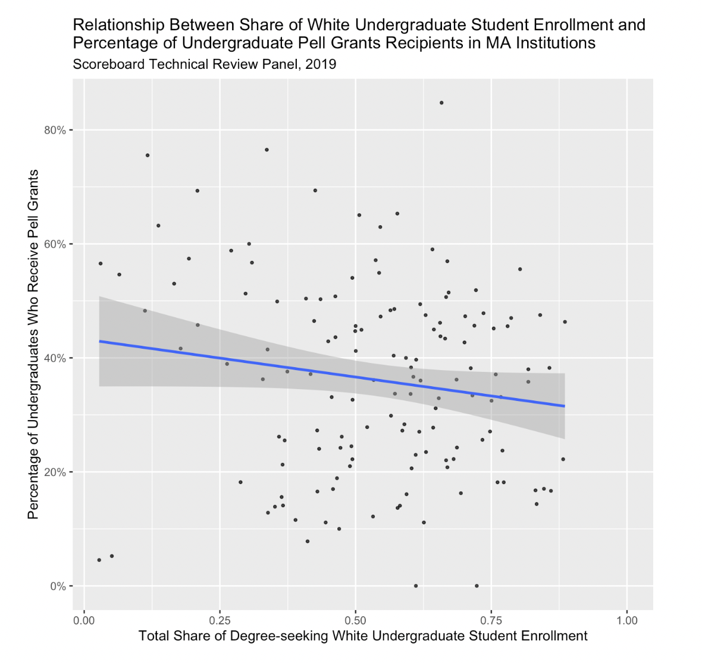
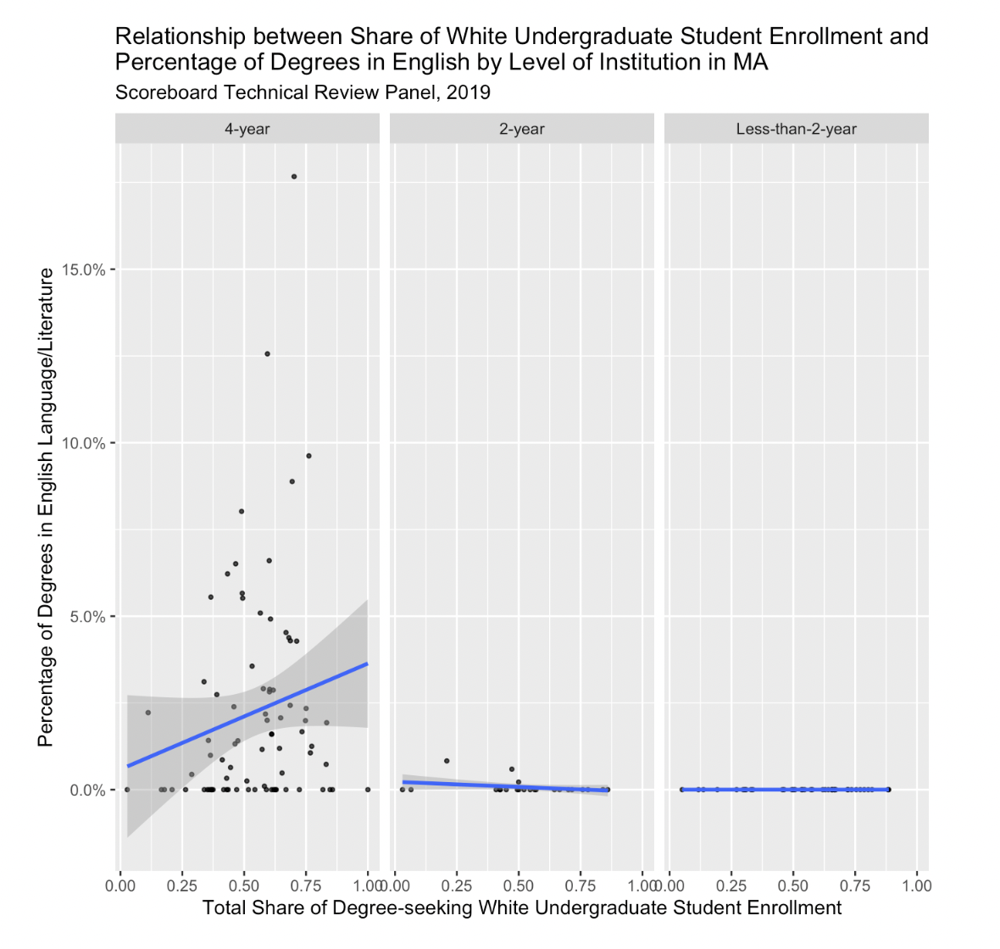
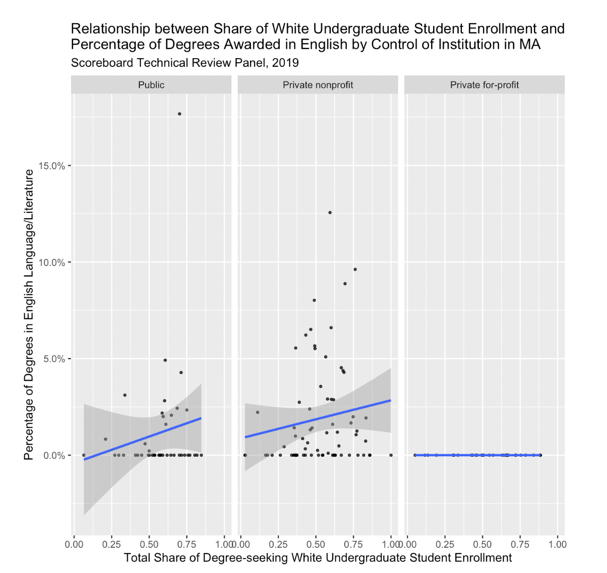
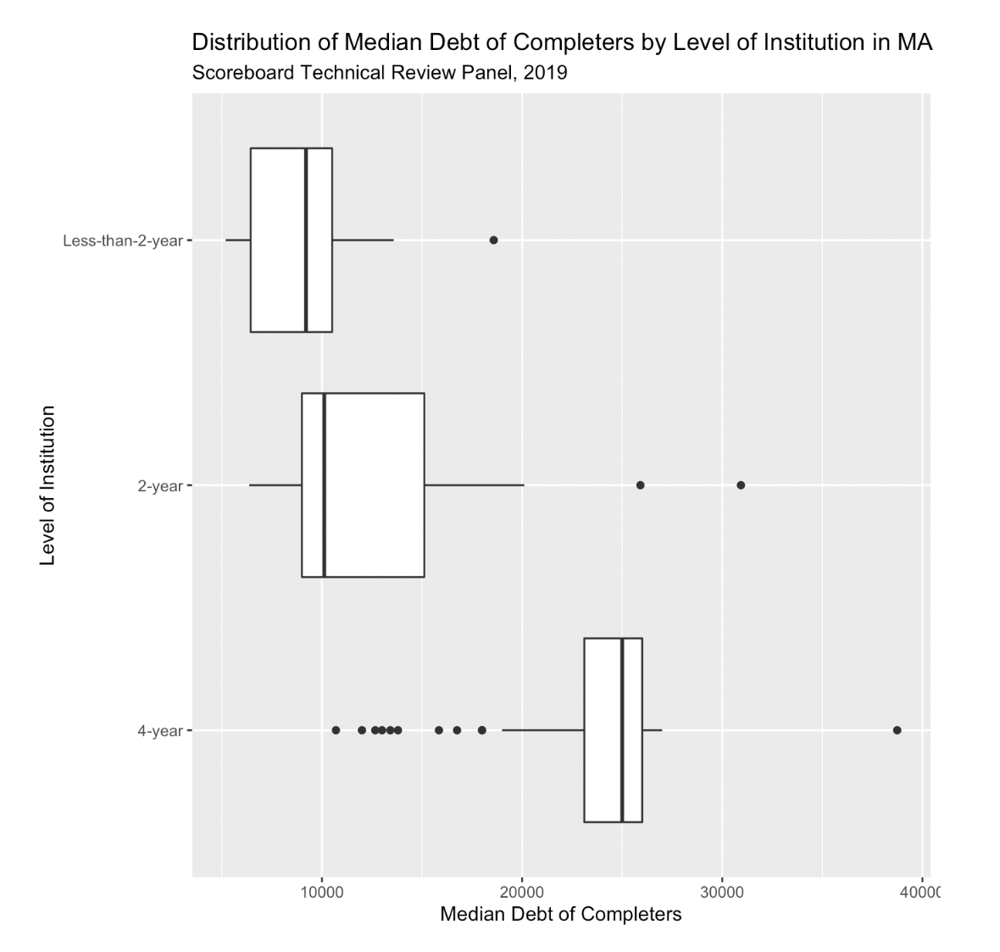
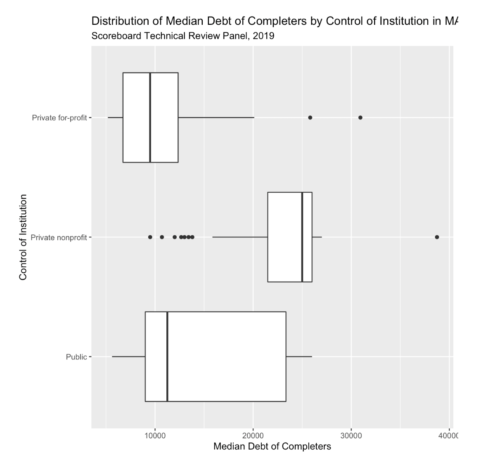

> Used [**College Scorecard**](https://collegescorecard.ed.gov/) data to visualize the relationship between students enrollment and the percentage of degrees in English dependant on the type and level of institution in Massachusetts. 

## Table of Contents

1. [About the Dataset](#about)
    
2. [Univariate Plot](#univariate)

3. [Multivariate Plot](#multivariate)

4. [Ethical Concern](#ethical)

## 1. About the Dataset
[Back to ToC](#toc)

The dataset we are working with is from the U.S. Department of Education and is referred to as the College Scoreboard. It breaks down many elements that students and families may want to consider when looking into different college institutions. It is collected from federal reports of institutions, federal financial aid, and tax information. In our plots we will be visualizing the relationship between degree-seeking undergraduate white students and the percentage of degrees in English Language and Literature dependent on the institution level in Massachusetts (less than 2yr, 2yr, 4yr).

## 2. Univariate Plot
[Back to ToC](#toc)

In the Univariate plot we can see that it resembles a normal distribution, with the highest values being between 50% and 75%. This indicates that the majority of institutions have between 50% and 75% of white degree-seeking undergraduate students.

## 3. Multivariate Plot
[Back to ToC](#toc)

In the multivariate graph of the relationship between white undergraduate students and degrees in english by level of Institution in Massachusetts. When these variables are plotted with each other, we can see that 4-year institutions have a clear slope as well as more scattered data points. This clearly indicates that 4-year institutions have students receiving more degrees in English language/literature. Furthermore, the slight slope indicates that 4-year institutions with a higher percentage of white undergraduate students, have a higher percentage of degrees received in English language/literature.

 

 

 

 

 

 
      
## 4. Ethical Concern
[Back to ToC](#toc)

There are students who don’t take the surveys sent out to get this data. There are students that may not have the time to fill out the surveys. Students might have misinterpreted questions wrong on the survey and answered it incorrectly, making the information inaccurate. The assumptions are that these numbers are accurate and representative of the data being displayed. This data can be beneficial to high school students and parents looking for rough numbers on certain statistics to determine if an institution is suitable for them or not. This data can be harmful because the numbers may not be accurate and might give a false impression to the high school student/parent.